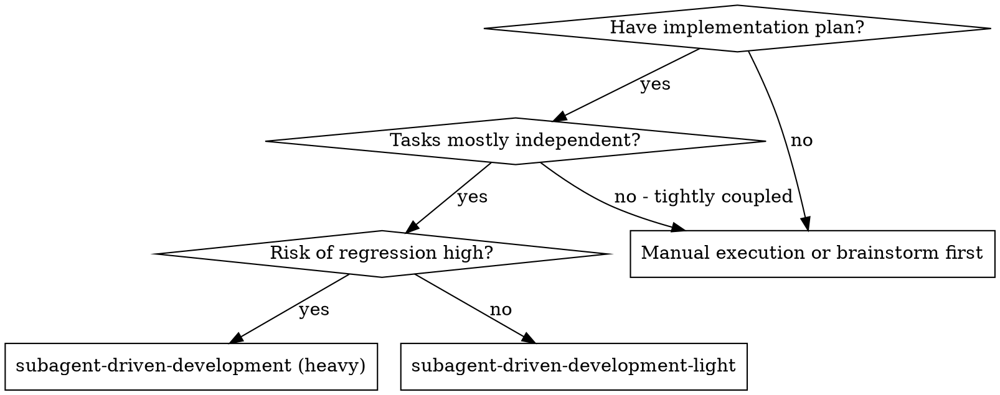
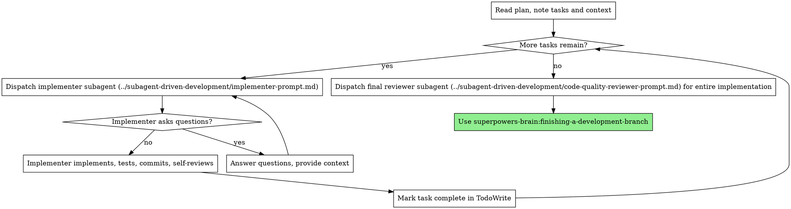

# Subagent-Driven Development (Light)

A lighter sibling of `subagent-driven-development`. Same core idea — fresh subagent per task for context isolation — but with less ceremony and a single review at the end instead of two-stage review after every task.

**Use this when:** the heavy variant would add more process than the task's risk level justifies. If the plan is small, exploratory, or throwaway, the full spec-reviewer / code-quality-reviewer loop per task is overkill.

**Use the heavy variant (`subagent-driven-development`) instead when:** the work is merge-to-main-grade, crosses multiple subsystems, or the cost of a regression is meaningfully higher than the cost of review.

## Core principle

Fresh subagent per task + one end-of-plan review = fast iteration, trust the implementer to self-review, catch anything important in one pass at the end.

## When to Use

## The Process

## What this variant does differently

Compared to `subagent-driven-development`:

| Heavy | Light |
|---|---|
| Extract all tasks upfront with full text + context into TodoWrite | Read plan, note what's there; pull task text as you dispatch each one |
| Per-task: implementer → spec reviewer (loop) → code quality reviewer (loop) | Per-task: implementer; trust self-review |
| Two reviewer prompt templates dispatched per task | No per-task review dispatch |
| Final code reviewer at end | Final code reviewer at end (same) |
| Blocks on spec or quality issues before moving to next task | Keeps moving; issues surface in the final review |

Everything else — fresh subagent per task, isolated context, implementer prompt, model selection, status handling, the `using-git-worktrees` requirement, the `finishing-a-development-branch` handoff — works the same as the heavy variant.

## Trust but verify

The single end-of-plan reviewer subagent is the safety net. Give it enough context to review the whole implementation in one pass:

- All commits since the plan started
- The plan itself (full text)
- Any spec or design the plan was built from

If the reviewer flags issues, fix them inline or dispatch a fix subagent per issue — don't throw away the work done to that point.

## Prompt Templates

Reuses the heavy variant's prompts — no need to maintain separate copies:

- `../subagent-driven-development/implementer-prompt.md` — dispatch implementer subagent
- `../subagent-driven-development/code-quality-reviewer-prompt.md` — dispatch final reviewer at end

## Handling Implementer Status

Same four statuses as the heavy variant: **DONE**, **DONE_WITH_CONCERNS**, **NEEDS_CONTEXT**, **BLOCKED**. Handle each the same way — see `subagent-driven-development/SKILL.md`.

## Red Flags

Most of the heavy variant's red flags still apply. Relaxed:

- Per-task review loops — **skipped by design**, not a red flag.

Still in force:

- Never start implementation on main/master without explicit consent.
- Don't dispatch multiple implementation subagents in parallel for conflicting files.
- Answer implementer questions before letting them proceed.
- If the implementer says BLOCKED, something needs to change.
- Skip the final end-of-plan review? That's the variant's only safety net — don't.

## Integration

Same as the heavy variant:

- **superpowers-brain:using-git-worktrees** — set up isolated workspace before starting
- **superpowers-brain:writing-plans** — creates the plan this skill executes
- **superpowers-brain:test-driven-development** — implementer subagents follow TDD per task
- **superpowers-brain:finishing-a-development-branch** — complete development after all tasks

**Alternatives:**

- **superpowers-brain:subagent-driven-development** — heavier variant with per-task review gates
- **superpowers-brain:executing-plans** — parallel-session batch execution with checkpoints
