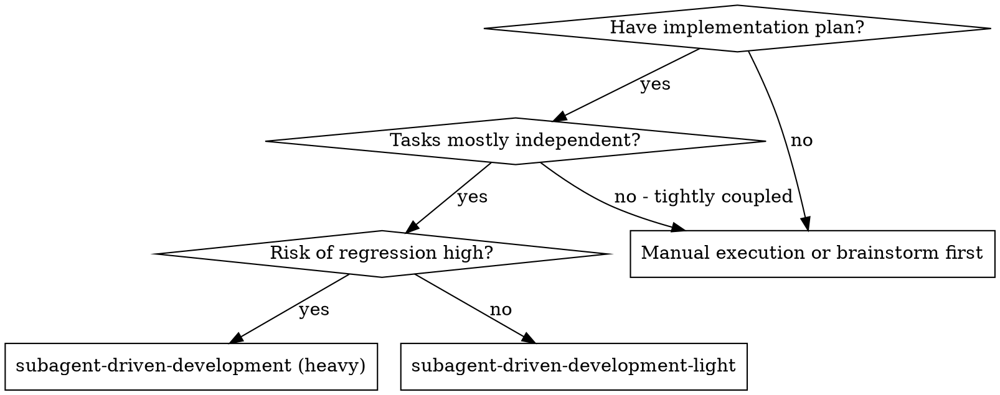
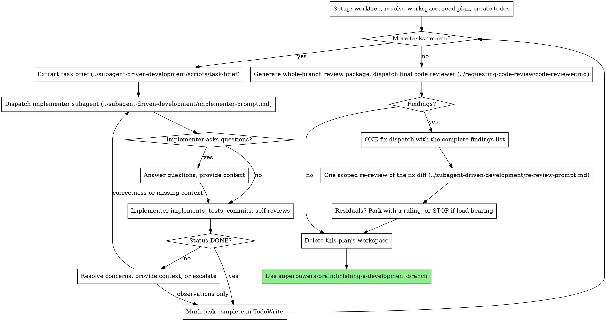

# Subagent-Driven Development (Light)

A lighter sibling of `subagent-driven-development`. Same core idea — a fresh implementer subagent per task, working from a task brief file for context isolation — but no task review after each task and no per-task fix loop. One broad whole-branch review at the end instead.

**Use this when:** the heavy variant would add more process than the task's risk level justifies. If the plan is small, exploratory, or throwaway, a task-review gate plus a bounded fix loop on every task is overkill.

**Use the heavy variant (`subagent-driven-development`) instead when:** the work is merge-to-main-grade, crosses multiple subsystems, or the cost of a regression is meaningfully higher than the cost of review. Switching mid-plan is cheap — the workspace, briefs, and reports carry over unchanged, so change variants at a task boundary rather than talking yourself out of review.

## Core principle

Fresh subagent per task + one end-of-plan review = fast iteration, trust the implementer to self-review, catch anything important in one pass at the end.

**Continuous execution:** Do not pause to check in with your human partner between tasks. The only reasons to stop are a BLOCKED status you cannot resolve, ambiguity that genuinely prevents progress, or all tasks complete. "Should I continue?" prompts waste the speed this variant exists for.

## When to Use

For batch execution with human checkpoints in a separate session instead, use superpowers-brain:executing-plans. The plan itself comes from superpowers-brain:writing-plans.

## The Process

## Setup

Ensure the work happens in an isolated workspace: use superpowers-brain:using-git-worktrees to create one or verify the existing one. Never start implementation on a main/master branch without your human partner's explicit consent.

This plan gets a scratch directory for its briefs, reports, and review packages. Run the heavy variant's script — this skill keeps no copies:

- `../subagent-driven-development/scripts/sdd-workspace PLAN_FILE` prints the plan's git-ignored directory (`<repo-root>/.superpowers/sdd/<plan-basename>/`). Everything for THIS plan lives there; another plan's directory is never yours to read or write.
- There is no progress ledger in this variant. Your record is your todos plus `git log`, with the implementer reports in the workspace as backup. If your session compacts mid-plan, rebuild from those before dispatching anything — re-dispatching a finished task is the expensive failure. A plan long enough that you expect a compaction wants the heavy variant, which keeps a ledger for exactly this.
- `git clean -fdx` will destroy the workspace (it's git-ignored scratch); recover from `git log`.

Read the plan once, note its context and Global Constraints, and create a todo per task. There is no pre-flight conflict scan in this variant — plan contradictions surface when an implementer hits them or when the final review does. If you already know the plan is self-contradictory, that is a signal for the heavy variant, not something to paper over here.

> **Brain mode:** In a Brain vault (a `.brain/` directory exists in this
> directory or an ancestor), PLAN_FILE is the vault artefact
> (`_Temporal/Plans/yyyy-mm/yyyymmdd-plan~{Title}.md`). The workspace still
> belongs to the **code repo** — `sdd-workspace` resolves it from
> `git rev-parse --show-toplevel`, and it never lands in the vault.
>
> Brain plan basenames contain spaces and a `~`, so the workspace directory
> does too (`.superpowers/sdd/20260504-plan~Feature plan/`). Quote every plan,
> workspace, brief, report, and review-package path — in script invocations,
> in `rm -rf "<workspace>"`, and in the paths you paste into dispatch prompts
> (`"<workspace>/task-3-brief.md"`). An unquoted path is how a subagent reads
> the wrong file and how `rm -rf` deletes the wrong thing.
>
> Once the workspace is resolved, mark the plan as implementing:
> `brain_edit(resource="artefact", path="<plan path>", operation="edit", frontmatter={"status": "implementing"})`
> (omit `body` — frontmatter-only change). Whichever executor runs owns these
> transitions; superpowers-brain:executing-plans states the same contract.

## Model Selection

Identical to the heavy variant — see its Model Selection section. The two rules that matter most here: **always specify the model explicitly** (an omitted model inherits your session's, usually the most expensive), and dispatch the single final review on the **most capable available model**, since it is this variant's only review.

## The Task Loop

Everything you paste into a dispatch prompt — and everything a subagent prints back — stays resident in your context for the rest of the session. Hand artifacts over as files.

### 1. Dispatch the implementer

- **Task brief:** run `../subagent-driven-development/scripts/task-brief PLAN_FILE N`. It extracts the task's full text to a uniquely named file and prints the path. The brief is the single source of requirements: exact values (numbers, magic strings, signatures, test cases) appear only there.
- **Report file:** name it after the brief (`…/task-N-brief.md` → `…/task-N-report.md`) and put the path in the dispatch prompt. The implementer writes its full report there and returns only status, commits, a one-line test summary, and concerns.
- Your dispatch contains: (1) one line on where this task fits; (2) the brief path, introduced as "read this first — it is your requirements, with the exact values to use verbatim"; (3) interfaces and decisions from earlier tasks the brief cannot know; (4) your resolution of any ambiguity you noticed in the brief; (5) the report-file path and report contract. Never make a subagent read the whole plan file, and never paste accumulated prior-task history — a fresh subagent needs its task, the interfaces it touches, and the global constraints. Nothing else.
- Never dispatch multiple implementation subagents in parallel (conflicting files).
- Implementers follow superpowers-brain:test-driven-development per task; the prompt template requires RED/GREEN evidence in the report when TDD applies.

Template: [../subagent-driven-development/implementer-prompt.md](../subagent-driven-development/implementer-prompt.md)

### 2. Handle the report

Implementer subagents report one of four statuses:

**DONE:** Mark the todo complete and move to the next task. No review package, no task reviewer — that is the whole difference from the heavy variant.

**DONE_WITH_CONCERNS:** Read the concerns. If they are about correctness or scope, resolve them now — resume the implementer with the specific concern rather than carrying it forward. If they are observations ("this file is getting large"), add them to a short running list of deferred concerns and proceed.

**NEEDS_CONTEXT:** Provide the missing information and re-dispatch.

**BLOCKED:** Assess the blocker: a context problem gets more context and the same model; a reasoning problem gets a more capable model; an oversized task gets broken up; a wrong plan gets escalated to your human partner. **Never** ignore an escalation or force the same model to retry without changes.

If the implementer asks questions — before starting or mid-task — answer clearly and completely before letting it proceed.

Keep the deferred-concerns list short and in your own notes; it is an input to the final review, and a list nobody hands to the reviewer is a silent discard.

## Final Review

The single whole-branch review is this variant's only safety net.

1. Record `MERGE_BASE` (the commit the branch started from, e.g. `git merge-base main HEAD`) and generate the package: `../subagent-driven-development/scripts/review-package PLAN_FILE MERGE_BASE HEAD`. It prints the file path — the reviewer reads one file instead of re-deriving the branch diff.
2. Record `FIX_BASE` = `git rev-parse HEAD` at the moment you dispatch the reviewer. That is the head the review saw, and the scoped re-review needs it.
3. Dispatch a `general-purpose` subagent on the most capable available model using superpowers-brain:requesting-code-review's [code-reviewer.md](../requesting-code-review/code-reviewer.md), with the plan path as requirements, the printed package path, and your deferred-concerns list so it can triage which of them must be fixed before merge.

If the review returns findings, dispatch **ONE** fix subagent with the complete findings list — not one fixer per finding. Per-finding fixers each rebuild context and re-run suites; a real session's per-finding final-review fix wave cost more than all its task work combined. Never fix findings yourself in the controller session: controller fixes pollute your context and skip review.

Then run exactly one scoped re-review of the fix wave: `../subagent-driven-development/scripts/review-package PLAN_FILE FIX_BASE HEAD` over the fix range, dispatched with [../subagent-driven-development/re-review-prompt.md](../subagent-driven-development/re-review-prompt.md) and the findings list. The re-reviewer verdicts each finding ADDRESSED or NOT ADDRESSED and flags new breakage in the fix diff only; out-of-scope observations are non-blocking.

Adjudicate any residual findings yourself — you hold the plan context the reviewer lacks:

- **Wrong, contestable, or real-but-nothing-builds-on-it:** park it with a one-line ruling saying why the code stands (or that it is real and deferred).
- **Real and load-bearing** — it reveals a plan defect or something downstream depends on it: STOP and report to your human partner with the finding, the plan text it collides with, and what the fix attempt did.

There is no second fix wave. Residual load-bearing findings surface to your human partner when finishing-a-development-branch presents the options.

## Finish

When the final review is clean and its fixes are in, delete this plan's workspace (`rm -rf "<workspace>"`) — the git history is the record now. Sibling directories belong to other plans; leave them alone.

> **Brain mode:** the git history is the record for *code*, not for
> adjudications — a parked ruling and a deferred concern exist in no commit,
> and this variant has no ledger holding them either. Before
> `rm -rf "<workspace>"`, write them into the Brain plan body (or a
> `decision-logs` artefact linked from it) with
> `brain_edit(resource="artefact", path="<plan path>", operation="edit", body=...)`:
>
> - every final-review residual you parked, with its one-line ruling
> - every implementer concern you deferred to the final review and the review's
>   triage of it
> - any load-bearing residual that stopped the run — write this one into the
>   plan the moment it happens, not at Finish; the plan is defective and must
>   say so
>
> Flush first, delete second — after `rm -rf` the rulings are gone.
>
> Then set the plan's terminal status once
> superpowers-brain:finishing-a-development-branch returns:
> `frontmatter={"status": "completed"}` — or `"parked"` if a load-bearing
> residual stopped the run, in which case the reason is already in the plan
> body. `completed` means "execution is finished", not "branch is merged".

Use superpowers-brain:finishing-a-development-branch.

## What this variant does differently

Compared to `subagent-driven-development`:

| Heavy | Light |
|---|---|
| Pre-flight conflict scan of the whole plan before Task 1 | No scan; contradictions surface mid-task or in the final review |
| Progress ledger (`<workspace>/progress.md`) as the compaction-proof record | No ledger; todos + `git log` + the workspace's report files |
| Task review after every task: review package + task reviewer, spec and quality verdicts both required | No per-task review; the implementer's self-review is the only per-task check |
| Up to five fix rounds per task — resume the implementer, then escalate to a fresh one on a better model | No per-task fix loop; DONE moves to the next task |
| Breaker at round 5: adjudicate each open finding, park with rulings or stop | Adjudication happens once, over the final review's residuals |
| Blocks on spec or quality findings before the next task | Keeps moving; everything surfaces in the final review |
| Whole-branch final review: ONE fix dispatch, one scoped re-review, adjudicate residuals | Same — and it is the only review |

Everything else is shared with the heavy variant and not duplicated here: the plan-scoped workspace, `task-brief`, `review-package`, the implementer and re-review prompt templates, model selection, the worktree requirement, and the `finishing-a-development-branch` handoff.

## Common Rationalizations

| Excuse | Reality |
|--------|---------|
| "Light means I can skip the end review too" | Then it isn't light, it's unreviewed. The whole-branch review is the only safety net this variant has. |
| "Each finding deserves its own fixer" | Per-finding fixers rebuild context and re-run suites each time; one real session's per-finding fix wave cost more than all its tasks combined. One dispatch, all findings. |
| "The fix was small, skip the re-review" | Unreviewed fixes are how regressions land. One fix wave, one scoped re-review — both, always. |
| "One more fix wave and it'll be clean" | There is one wave. Residuals get a ruling or your human partner, not another round. |
| "I'll just fix this finding myself, dispatching is overhead" | Controller fixes pollute your context and skip review entirely. |
| "Pasting the task text is faster than running task-brief" | Everything you paste stays in your context for the whole session. That is why the brief is a file. |
| "No ledger means nothing to track" | Todos, `git log`, and the report files are the record. Controllers who lost their place have re-dispatched entire completed task sequences. |
| "The risk went up mid-plan but I've already started light" | Switch at the next task boundary. The workspace, briefs, and reports carry over unchanged. |
| "The implementer self-reviewed, so quality is covered" | Self-review catches what the implementer can see. That is the deal this variant makes — and why the final review is non-negotiable. |
